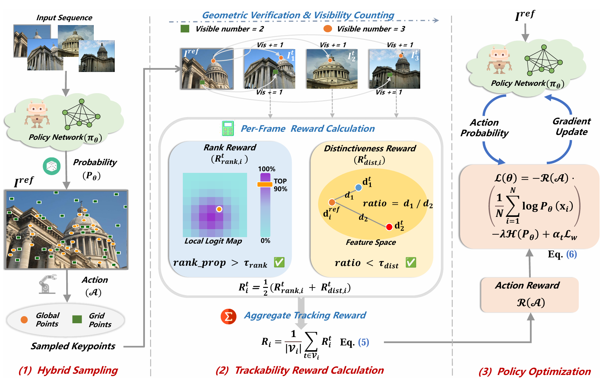

<div align="center">

<h1>TraqPoint</h1>
<h3><a href="https://arxiv.org/pdf/2602.20630">From Pairs to Sequences: Track-Aware Policy Gradients for Keypoint Detection</a></h3>

Yepeng Liu<sup>1,2\*</sup>, Hao Li<sup>2\*</sup>, Liwen Yang<sup>1\*</sup>,
Fangzhen Li<sup>2†</sup>, Xudi Ge<sup>1</sup>, Yuliang Gu<sup>1</sup>,
Kuang Gao<sup>2</sup>, Bing Wang<sup>2</sup>, Guang Chen<sup>2</sup>,
Hangjun Ye<sup>2</sup>, Yongchao Xu<sup>1†✉</sup>

<div align="center">

</div>

<div align="center">

## Abstract

<div style="text-align: justify; max-width: 800px; margin: 0 auto;">

Keypoint-based matching is a fundamental component of modern 3D vision systems, such as Structure-from-Motion (SfM) and SLAM. Most existing learning-based methods are trained on image pairs, a paradigm that fails to explicitly optimize for the long-term trackability of keypoints across sequences under challenging viewpoint and illumination changes.

<details><summary>CLICK for the full abstract</summary>

> In this paper, we reframe keypoint detection as a sequential decision-making problem. We introduce TraqPoint, a novel, end-to-end Reinforcement Learning (RL) framework designed to optimize the Track-quality (Traq) of keypoints directly on image sequences. Our core innovation is a track-aware reward mechanism that jointly encourages the consistency and distinctiveness of keypoints across multiple views, guided by a policy gradient method. Extensive evaluations on sparse matching benchmarks, including relative pose estimation and 3D reconstruction, demonstrate that TraqPoint significantly outperforms some state-of-the-art (SOTA) keypoint detection and description methods.
</details>

</div>

</div>

<sup>1</sup>School of Computer Science, Wuhan University
<sup>2</sup>Xiaomi EV

(\*) Equal contribution. (†) Project leader. (✉) Corresponding author.

**IEEE/CVF Conference on Computer Vision and Pattern Recognition (CVPR), 2026**

</div>

---

This repository now supports **two-stage training**:
1) **Stage-1 Descriptor Training**: Generates descriptor weights for matching/tracking.
2) **Stage-2 Keypoint/Policy Training**: Loads Stage-1 weights and uses reinforcement learning to optimize the keypoint sampling policy.

---

## Table of Contents

- [Installation](#installation)
- [Third-party dependencies](#third-party-dependencies)
- [Quick Start](#quick-start)
  - [Dataset Preparation](#dataset-preparation)
  - [Stage-1 (Descriptor Training)](#stage-1-descriptor-training)
  - [Stage-2 (Keypoints/RL Training)](#stage-2-keypointsrl-training)
- [Relative Pose Estimation](#relative-pose-estimation)
  - [Download Test Sets](#1-download-test-sets)
  - [Run Evaluation](#2-run-evaluation)
- [Visual Odometry](#visual-odometry-kitti)
  - [Download KITTI Dataset](#1-download-kitti-dataset)
  - [Run VO Evaluation](#2-run-vo-evaluation)
- [Structure from Motion](#structure-from-motion-sfm-test)
- [Pretrained Models](#pretrained-models)
- [Citation](#citation)
- [License](#license)

---
## Installation

Create an environment (Python 3.10+ recommended), then install dependencies:

```bash
pip install -r requirements.txt
```

Notes:
- `hloc` and `pycolmap` are only required for the SfM demo (`demo_sfm.py`). If you only run training/benchmarks, you may omit them.

---
## Third-party dependencies

This repository does **not** redistribute third-party source code or model weights.

1) Install third-party source code into `./third_party/`:

```bash
bash scripts/setup_third_party.sh
```

After running the setup script, the following subdirectories will be created in `./third_party/`:
- `facebookresearch_dinov3_main` - DINOv3 model repository
- `Hierarchical-Localization-master` - Hierarchical Localization library
- `LightGlue` - LightGlue feature matching library

2) Place required weight files into `./third_party/` (see `docs/THIRD_PARTY.md`).

**Important for DINOv3**: After installing the DINOv3 repository, you need to manually apply for the `dinov3_convnext_base_pretrain_lvd1689m-801f2ba9.pth` weight file and move it to the `third_party` folder.

If you see an error like "Missing required third-party repo/weights", it usually means step (1) or (2) was skipped.

---
## Quick Start


### Dataset Preparation

> **Disclaimer**: Datasets are not included in this repository. Please download from official sources and comply with their respective licenses. Some datasets (e.g., ScanNet, KITTI) are restricted to non-commercial research use only.

**1. MegaDepth for Stage-1 (Descriptor Training)**

The descriptor training stage uses the standard MegaDepth dataset.

1.  Download the MegaDepth dataset and the official `megadepth_indices` from the original [LoFTR repository](https://github.com/zju3dv/LoFTR/blob/master/docs/TRAINING.md#download-datasets).
2.  Your MegaDepth root folder should be organized as follows:

    ```bash
    /path/to/megadepth/
    ├── megadepth_indices   # indices
    ├── depth_undistorted   # depth maps
    ├── Undistorted_SfM     # images and poses
    └── scene_info          # indices for training
    ```

**2. Sequence Generation for Stage-2 (Keypoint Training)**

The keypoint training stage requires sequence data, which is generated from the pair-wise `scene_info` files.

1.  The script uses the `scene_info_0.1_0.7` directory (containing pair-wise data) as input.
2.  Run the sequence generation script:

    ```bash
    # This script reads from .../scene_info_0.1_0.7 and generates sequence npz files
    python -m traqpoint.dataset.megadepth.generate_mega_indice
    ```
3.  The output will be a new directory named `sequence_indices_0.1_0.7_s5`, containing the sequence `.npz` files required for Stage-2 training.

### Stage-1 (Descriptor Training)
First, download the official DINOv3 weights (`dinov3_convnext_base_pretrain_lvd1689m-801f2ba9.pth`) and place them in the `third_party` directory, or update the model path in `backbone_dinov3_conv.py`. Then, run the training command.

The following command starts distributed training, automatically utilizing all available GPUs.
```bash
python -m training.train_descriptor \
  --distributed \
  --ckpt_save_path ./outputs/stage1-des \
  --batch_size 32 \
  --training_res 800 \
  --lr 1e-4 \
  --gamma_steplr 0.5 \
  --save_ckpt_every 1000 \
  --test_every_iter 3000 \
  --epochs 12
```
- A convenience script is also available: `train_descriptor.sh`.
- For single GPU training, remove the `--distributed` flag and adjust the batch size.
- You can override default dataset paths or load pre-trained weights with arguments like `--megadepth_root_path`, `--test_data_root`, and `--weights`.
- The output checkpoint is a `state_dict`, which can be directly loaded by Stage-2 using the `--weights` argument.

### Stage-2 (Keypoints/RL Training)
```bash
python -m training.train_key \
  --train_detector --distributed \
  --weights /path/to/stage1_descriptor.pth \
  --ckpt_save_path ./outputs/key_run1 \
  --sampling_strategy hybrid --num_global_samples 112 \
  --grid_size 40 --ratio_thresh 0.5 \
  --batch_size 120 --training_res 480
```
- **Required**: The `--weights` argument must point to the Stage-1 checkpoint.
- A convenience script is also available: `train_key.sh`.

---
## Relative Pose Estimation
**1. Download Test Sets**

The evaluation uses the MegaDepth-1500 and ScanNet-1500 test sets. You can download them from this [Google Drive link](https://drive.google.com/drive/folders/1QgVaqm4iTUCqbWb7_Fi6mX09EHTId0oA) (provided by the RDD project).

After downloading and extracting, your test data folder should look like this:
```bash
/path/to/test_data/
├── megadepth_test_1500/
└── scannet_test_1500/
```
Update the `--data_root` argument in the benchmark scripts to point to the correct path.

**2. Run Evaluation**
- MegaDepth 1500 (Outdoor)
```bash
python -m benchmarks.mega_1500 --weights ./weights/traqpoint_best.pth --method sparse --plot --data_root /path/to/test_data/megadepth_test_1500
```
  - Metrics output: `outputs/mega_1500/traqpoint_sparse.txt`
  - Visualization: PNG files in `outputs/mega_1500/` (if `--plot` is enabled)
- ScanNet 1500 (Indoor)
```bash
python -m benchmarks.scannet_1500 --weights ./weights/traqpoint_best.pth --method sparse --plot --data_root /path/to/test_data/scannet_test_1500
```
  - Metrics output: `outputs/scannet/traqpoint_sparse.txt`
  - Visualization: PNG files in `outputs/scannet/` (if `--plot` is enabled)


---
## Visual Odometry (KITTI)
**1. Download KITTI Dataset**
Download the raw dataset from the official [KITTI website](https://www.cvlibs.net/datasets/kitti/raw_data.php). The evaluation script requires the color image sequences and the corresponding calibration files.

**2. Run VO Evaluation**
- VO evaluation script:
```bash
python -m benchmarks.visual_odometry.demo_vo_evaluator \
  --path1 /path/to/kitti/dataset \
  --path2 /path/to/kitti/dataset/sequences/01/image_0/ \
  --id 01 \
  --out_dir ./outputs/vo_kitty_results
```
- The script uses default values for other parameters like detection threshold and tracking settings for a quick test.
- Output files:
  - Keypoint video: `kitti_*_keypoints.avi`
  - Trajectory video: `kitti_*_trajectory.avi`
  - Pose log: `kitti_*.txt`
  - Evaluation results: `kitti_results.json`

---
## Structure from Motion (SfM) Test
- SfM reconstruction script:
```bash
python demo_sfm.py
```
- **Dependency**: Requires an `hloc` (hierarchical localization) environment.
- **Supported Datasets**:
  - Madrid_Metropolis
  - Gendarmenmarkt
  - Tower_of_London
- **Configuration**:
  - Image path: Modify the `images_dir` variable to point to the dataset image directory.
  - Output path: Modify the `outputs` variable to specify the reconstruction output location.
  - Feature config: Uses the `traqpoint` feature extractor.
  - Matcher config: Uses the `traqpoint+dual_softmax` matcher.
- **Processing Pipeline**:
  1. Image Retrieval (NetVLAD) → Generate image pairs
  2. Feature Extraction (TraqPoint) → Extract keypoints and descriptors
  3. Feature Matching → Generate match graphs
  4. 3D Reconstruction → Generate sparse point cloud and camera poses
- **Output**:
  - Sparse reconstruction model
  - Camera pose estimations
  - Depth visualization (`color_by="depth"`)


---
## Pretrained Models

The pretrained TraqPoint models are now available on [Hugging Face](https://huggingface.co/lihao20888/traqpoint/tree/main):

- [`stage1_des.pth`](https://huggingface.co/lihao20888/traqpoint/blob/main/stage1_des.pth): Stage-1 descriptor weights used to initialize Stage-2 keypoint/policy training.
- [`traqpoint_best.pth`](https://huggingface.co/lihao20888/traqpoint/blob/main/traqpoint_best.pth): Final trained model used for evaluation.

For evaluation, download `traqpoint_best.pth` to `./weights/`:

```bash
curl -L https://huggingface.co/lihao20888/traqpoint/resolve/main/traqpoint_best.pth \
  -o weights/traqpoint_best.pth
```

---
## Citation
```
 @article{liu2026pairs,
  title={From Pairs to Sequences: Track-Aware Policy Gradients for Keypoint Detection},
  author={Liu, Yepeng and Li, Hao and Yang, Liwen and Li, Fangzhen and Ge, Xudi and Gu, Yuliang and Wang, Bing and Chen, Guang and Ye, Hangjun and Xu, Yongchao and others},
  journal={arXiv preprint arXiv:2602.20630},
  year={2026}
}
```

---
## Acknowledgements

We thank these great repositories: [ALIKE](https://github.com/Shiaoming/ALIKE), [LoFTR](https://github.com/zju3dv/LoFTR), [DeDoDe](https://github.com/Parskatt/DeDoDe), [XFeat](https://github.com/verlab/accelerated_features), [LightGlue](https://github.com/cvg/LightGlue), [Kornia](https://github.com/kornia/kornia), and [Deformable DETR](https://github.com/fundamentalvision/Deformable-DETR),[RDD](https://github.com/xtcpete/rdd/tree/main) and many other inspiring works in the community.

---
## License
This project is licensed under the Apache License 2.0.
